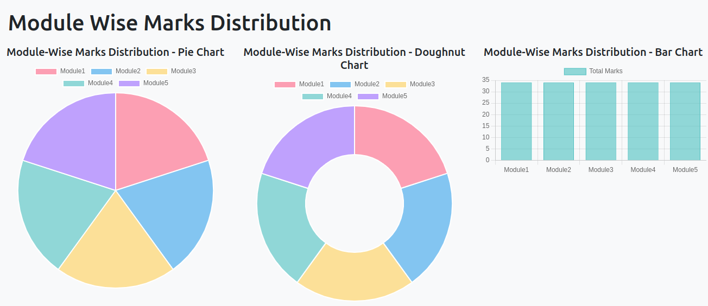

# Course Syllabus API Documentation

This project provides a robust API system to manage and retrieve course syllabus information efficiently. It supports multiple operations related to course syllabus management.

---

## **API Overview**

This API system includes the following endpoints:

1. [Get Topics for a Module](#1-get-topics-for-a-module)

---

## **1. Get - /api/getTopicsSyllabus/<str:CourseCode>/<int:Module>/**

### **Description**
Retrieve the head and syllabus of a specific module for a given course.

- **URL**: `/api/getTopicsSyllabus/<str:CourseCode>/<int:Module>/`
- **Method**: `GET`
- **Description**: Returns the head and syllabus for the given course code and module number.

---

### **Parameters**

| Parameter    | Type    | Required | Description                          |
|--------------|---------|----------|--------------------------------------|
| `CourseCode` | String  | Yes      | Unique identifier for the course.    |
| `Module`     | Integer | Yes      | Module number (1-5).                |

---

### **Response**

#### **Success Response**

- **Status Code**: `200 OK`
- **Format**: JSON
- **Example**:

<!-- #### Example Request Body -->
<!-- ```json -->
```json
{
    "CourseCode": "CS101",
    "Module": 1,
    "SubjectName": "Programming In Python",
    "Heading": "Introduction to Python",
    "Syllabus": "The os and sys modules, NumPy - Basics, Creating arrays, Arithmetic, Slicing, Matrix Operations, Random numbers. Plotting and visualization. Matplotlib - Basic plot, Ticks, Labels, and Legends. Working with CSV files. – Pandas - Reading, Manipulating, and Processing Data. Introduction to Micro services using Flask.",
    "Topics": [
        "The os and sys modules, NumPy - Basics, Creating arrays, Arithmetic, Slicing, Matrix Operations, Random numbers",
        "Plotting and visualization",
        "Matplotlib - Basic plot, Ticks, Labels, and Legends",
        "Working with CSV files",
        "Pandas - Reading, Manipulating, and Processing Data",
        "Introduction to Micro services using Flask"
    ]
}
```

## 2. POST /api/QuestionsToTopic/ 


### **Request Format**

#### **Headers**
- `Content-Type: application/json`

#### **Body**
The request body should contain the following fields:

| Field         | Type   | Description                                            |
|---------------|--------|--------------------------------------------------------|
| `course_code` | String | The course code for which the questions are provided.  |
| `questions`   | Array  | A list of questions to map to topics.                  |
| `module_info` | Array  | A list of module numbers corresponding to each question. |
| `marks_info`  | Array  | A list of marks corresponding to each question.        |

##### Example Request Body
```json
{
  "course_code": "CST205",
  "questions": [
    "What is polymorphism in OOP?",
    "Explain the concept of inheritance with an example."
  ],
  "module_info": [1, 1],
  "marks_info": [5, 10]
}
```

## 3. GET /addCoursesThroughCSV/
### Add Courses Through CSV
- **URL:** `/addCoursesThroughCSV/`
- **Method:** `GET`
- **Description:** This endpoint processes a predefined CSV file containing course details and saves the courses into the database.
- **Response:** 
  - **Success:** Returns `Success` upon successful processing and saving.
  - **Error:** Logs errors in the server console if any occur during processing.

---

### CSV File Format
Save the csv file in "QPaperAnalyzerProject/dataEntry/Syllabus_Dataset.csv"
The file should be a CSV with the following structure:

| Column Name           | Description                                                        |
|-----------------------|--------------------------------------------------------------------|
| Semester              | The semester in which the course is offered (e.g., `S6`).         |
| Sl No                 | Serial number of the course in the semester.                      |
| Course_Code           | Unique code for the course (e.g., `CSL 362`).                     |
| Subject Name          | The name of the course (e.g., `Programming In Python`).           |
| Module1 Heading       | Title of the first module.                                        |
| Module1 Syllabus      | Detailed syllabus of the first module.                           |
| Module2 Heading       | Title of the second module.                                       |
| Module2 Syllabus      | Detailed syllabus of the second module.                          |
| Module3 Heading       | Title of the third module.                                        |
| Module3 Syllabus      | Detailed syllabus of the third module.                           |
| Module4 Heading       | Title of the fourth module.                                       |
| Module4 Syllabus      | Detailed syllabus of the fourth module.                          |
| Module5 Heading       | Title of the fifth module.                                        |
| Module5 Syllabus      | Detailed syllabus of the fifth module.                           |
| Module6 Heading       | Title of the sixth module (optional).                            |
| Module6 Syllabus      | Detailed syllabus of the sixth module (optional).                |

---

## Example CSV File
```csv
Semester,Sl No,Course_Code,Subject Name,Module1 Heading,Module1 Syllabus,Module2 Heading,Module2 Syllabus,Module3 Heading,Module3 Syllabus,Module4 Heading,Module4 Syllabus,Module5 Heading,Module5 Syllabus,Module6 Heading,Module6 Syllabus
S6,1,CSL 362,Programming In Python,Programming Environment and Python Basics,"Getting started with Python programming – Interactive shell, IDLE...",Building Python Programs,"Strings and text files – Accessing characters, substrings...",Graphics,"Graphics – Terminal-based programs, Simple Graphics...",Object Oriented Programming,"Design with classes - Objects and Classes...",Data Processing,"The os and sys modules, NumPy - Basics, Creating arrays...",,
```

## 4. POST /api/QPaperExcelToDB/
### QPaper Excel to Database

### **Description**
This API processes a provided Excel file containing question paper data, extracts information, and stores it in the database.

---

### **Headers**

| Header         | Value             |
|-----------------|-------------------|
| Content-Type    | `application/json` |

---

### Request Body

The request body should be in JSON format and contain the following field:

| Field      | Type   | Description                                             |
|------------|--------|---------------------------------------------------------|
| `filename` | String | The name of the Excel file to process, including the extension. |

#### Example Request Body
```json
{
  "filename": "CST204_Regular_July_2021.xlsx"
}
```
### Success Response

```json
{
  "message": "File processed successfully and data stored in the database."
}

```
### Error Responses
1. 400 Bad Request: Missing or invalid input.
```json
{
  "error": "Filename is required."
}
```
2. 404 Not Found: File not found in the specified directory.
```json
{
  "error": "FileNotFoundError: [file_path] not found."
}
```
3. 400 Bad Request: Missing key in extracted JSON data.
```json
{
  "error": "KeyError: Missing key [key_name] in JSON data."
}

```

4. 500 Internal Server Error: Any other unexpected error during processing.
```json
{
  "error": "An unexpected error occurred: [error details]."
}

```

5. 405 Method Not Allowed: For HTTP methods other than POST.
```json
{
  "error": "Only POST method is allowed."
}
```

## 5. GET /api/getQuestionsTopicsAnswer/<int:QPaperID>/

### Overview
The API_QuestTopicAns endpoint retrieves detailed information about questions associated with a specific question paper (QPaperID). The data includes question text, marks, topic, module number, and an optional answer text.


### Description
Fetches a list of questions and their associated data for a given QPaperID.


### Request

QPaperID (integer): The unique identifier for the question paper.

### Request

#### Path Parameters
- **`QPaperID`** *(integer)*: The unique identifier for the question paper.

#### Example Request URL
```plaintext
GET /api/getQuestionsTopicsAnswer/42/
```

### Response

#### Success Response
On success, the endpoint returns a JSON object containing a list of questions. Each question includes details such as question text, marks, topic, module number, and answer text.

#### HTTP Status Code
200 OK

#### Response Body Example

```json
{
  "questions": [
    {
      "QuestionText": "List any three categories of database users, highlighting any one important characteristic of each category.",
      "Mark": 3,
      "Topic": "ER model - Basic concepts, entity set & attributes, notations, Relationships and constraints, cardinality, participation, notations, weak entities, relationships of degree 3",
      "ID": 31,
      "ModuleNumber": 1,
      "AnswerText": "Three categories of database users are:\n\n1. **Database Administrators (DBAs):** A key characteristic of DBAs is their responsibility for the overall performance and security of the database system. ..."
    },
    {
      "QuestionText": "What are the major differences between structured, unstructured and semi-structured data.",
      "Mark": 3,
      "Topic": "Concept & Overview of Database Management Systems (DBMS) - Characteristics of Database system, Database Users, structured, semi-structured and unstructured data",
      "ID": 32,
      "ModuleNumber": 1,
      "AnswerText": "Structured data is highly organized and easily searchable by traditional database applications ..."
    }
  ]
}
```

### Error Responses
#### Case 1: No Questions Found
If no questions are associated with the provided QPaperID, the API returns an error message.


##### HTTP Status Code
404 Not Found

##### Response Body Example
```json
{
  "error": "No questions found for the given QPaperID."
}
```

#### Case 2: Unexpected Errors
For any other unexpected errors, the API returns a generic error message.

##### HTTP Status Code
500 Internal Server Error

##### Response Body Example
```json
{
  "error": "An error occurred: <error_message>"
}
```


<!-- Database -->

# Database - Models

This document provides detailed information about the database models used in the EduSphere platform, an advanced educational management and analysis system. The models are designed to manage courses, quizzes, question papers, and profiles of users, among other entities.

---
## Database Design Diagram


## Table of Contents
- [Course](#1-course)
- [QPaper](#2-qpaper)
- [QPaperQuestions](#3-qpaperquestions)
- [PrivateQPaper](#4-privateqpaper)
- [PrivateQPaperQuestions](#5-privateqpaperquestions)
- [University](#6-university)
- [College](#7-college)
- [Profile](#8-profile)
- [Department](#9-department)
- [CollegeDepartmentMap](#10-collegedepartmentmap)
- [Department_Course_Map](#11-department_course_map)
- [Quiz](#12-quiz)
- [QnA](#13-qna)
- [QuizScore](#14-quizscore)

---

## Models

### 1. **Course**
Manages information about the courses offered.

- **Fields**:
  - `coursecode` (Primary Key): Unique course code (max length 8).
  - `subjectname`: Name of the subject.
  - `module1Head`, `module1Syllabus`: Module 1 details.
  - `module2Head`, `module2Syllabus`: Module 2 details.
  - `module3Head`, `module3Syllabus`: Module 3 details.
  - `module4Head`, `module4Syllabus`: Module 4 details.
  - `module5Head`, `module5Syllabus`: Module 5 details.
- **String Representation**: Course code.

---

### 2. **QPaper**
Stores information about question papers.

- **Fields**:
  - `QPaper_ID` (Primary Key): Auto-generated ID.
  - `CourseCode`: Foreign key linking to `Course`.
  - `Max_Marks`: Maximum marks for the question paper.
  - `Exam_Type`: Exam type (Supply or Regular).
  - `Exam_Name`: Name of the exam.
  - `Month_Year`: Exam month and year.
- **String Representation**: Course code and exam name.

---

### 3. **QPaperQuestions**
Stores questions in a question paper.

- **Fields**:
  - `ID` (Primary Key): Auto-generated ID.
  - `QPaper_ID`: Foreign key linking to `QPaper`.
  - `QuestionText`: Text of the question.
  - `Mark`: Marks for the question.
  - `Topic`: Topic of the question.
  - `Module_Number`: Associated module number.
  - `AnswerText`: Text for the answer.
- **String Representation**: Question and associated question paper.

---

### 4. **PrivateQPaper**
Handles privately created question papers.

- **Fields**:
  - `PrivateQPaper_ID` (Primary Key): Auto-generated ID.
  - `CourseCode`: Course code of the question paper.
  - `Max_Marks`: Maximum marks.
  - `Exam_Name`: Name of the private exam.
- **String Representation**: Course code and exam name.

---

### 5. **PrivateQPaperQuestions**
Stores questions for privately created question papers.

- **Fields**:
  - `ID` (Primary Key): Auto-generated ID.
  - `QPaper_ID`: Foreign key linking to `PrivateQPaper`.
  - `QuestionText`: Text of the question.
  - `Mark`: Marks for the question.
  - `Topic`: Topic of the question.
  - `Module_Number`: Associated module number.
- **String Representation**: Question and associated private question paper.

---

### 6. **University**
Manages information about universities.

- **Fields**:
  - `University_ID` (Primary Key): Auto-generated ID.
  - `University_Name`: Name of the university.
  - `Location`: Location of the university.
- **String Representation**: University name.

---

### 7. **College**
Manages information about colleges.

- **Fields**:
  - `CollegeID` (Primary Key): Auto-generated ID.
  - `CollegeName`: Name of the college.
  - `University_ID`: Foreign key linking to `University`.
  - `Address`: Address of the college.
- **String Representation**: College name.

---

### 8. **Profile**
Stores user profiles.

- **Fields**:
  - `user`: One-to-one relationship with Django's `User` model.
  - `name`: Name of the user.
  - `phone_num`: Phone number of the user.
  - `user_type`: User type (Student or Faculty).
  - `college`: Foreign key linking to `College`.
- **String Representation**: Username and user type.

---

### 9. **Department**
Stores department details.

- **Fields**:
  - `Department_ID` (Primary Key): Auto-generated ID.
  - `Department_Name`: Name of the department.
  - `Department_Code`: Code of the department.
- **String Representation**: Department name.

---

### 10. **CollegeDepartmentMap**
Maps colleges to their departments.

- **Fields**:
  - `ColDepartID` (Primary Key): Auto-generated ID.
  - `College_ID`: Foreign key linking to `College`.
  - `Department_ID`: Foreign key linking to `Department`.
- **String Representation**: College and department mapping.

---

### 11. **Department_Course_Map**
Maps departments to courses.

- **Fields**:
  - `Dep_Cour_ID` (Primary Key): Auto-generated ID.
  - `Department_ID`: Foreign key linking to `Department`.
  - `Course_ID`: Foreign key linking to `Course`.
- **String Representation**: Department and course mapping.

---

### 12. **Quiz**
Stores quizzes created by users.

- **Fields**:
  - `quiz_title`: Title of the quiz.
  - `creation_timestamp`: Auto-generated timestamp when created.
  - `scheduled_date`: Scheduled date for the quiz.
  - `max_score`: Maximum score for the quiz.
  - `created_by`: Foreign key linking to `Profile`.
  - `course_id`: Foreign key linking to `Course`.
  - `college_id`: Foreign key linking to `College`.
- **String Representation**: Quiz title.

---

### 13. **QnA**
Stores questions and answers for quizzes.

- **Fields**:
  - `quiz_qna_id` (Primary Key): Auto-generated ID.
  - `quiz`: Foreign key linking to `Quiz`.
  - `question_text`: Text of the question.
  - `option_1`, `option_2`, `option_3`, `option_4`: Options for the question.
  - `correct_option`: Correct option (1, 2, 3, or 4).
  - `mark`: Marks for the question.
- **String Representation**: Question and associated quiz.

---

### 14. **QuizScore**
Tracks scores for quizzes.

- **Fields**:
  - `profile`: Foreign key linking to `Profile`.
  - `quiz`: Foreign key linking to `Quiz`.
  - `score`: Score achieved by the user.
- **String Representation**: Username, quiz title, and score.

---


# Project Visuals/Images




